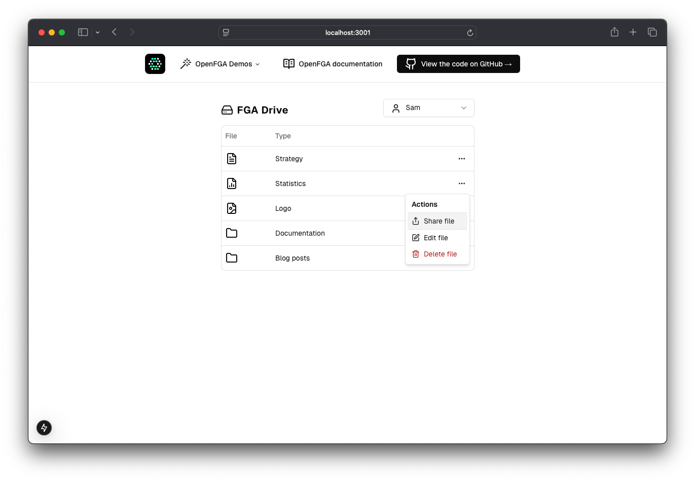

This application has a few small demos illustrating how to leverage OpenFGA/Auth0 FGA to deal with authorization.

## Configuration

### Brand Configuration
This demo supports both OpenFGA and Auth0 FGA branding. You can configure which brand to use by setting the `FGA_BRAND` environment variable in your `.env.local` file:

- `FGA_BRAND=OpenFGA` (default) - Uses OpenFGA branding, logos, and documentation links
- `FGA_BRAND=Auth0 FGA` - Uses Auth0 FGA branding, logos, and documentation links

## Getting Started


### Start your OpenFGA server
Make sure you've installed OpenFGA. More info at [https://openfga.dev/docs/getting-started/setup-openfga/overview](https://openfga.dev/docs/getting-started/setup-openfga/overviewdocs)
```
docker run -p 8080:8080 -p 8081:8081 -p 3000:3000 openfga/openfga run
```

### Create a .env file

Copy the `.env.sample` file and add the OpenFGA url and brand configuration. You should only do this once, the first time you setup the project.

```
cp .env.sample .env.local
```

Edit the `.env.local` file to configure your FGA API URL and preferred brand.

### Start your development server

```bash
npm run dev
# or
yarn dev
# or
pnpm dev
# or
bun dev
```

This will first run a setup script to create the demo FGA stores, models, and populate them with some example tuples.

Open [http://localhost:3001](http://localhost:3001) with your browser to see the result.

## Demo applications

### Online drive
This is a simple Google drive clone, that let's you share files and folders with other users. When sharing you have the option to assign roles like viewer, editor or owner to these files.




### Banking application
This application lets users see their checking and saving accounts. If you are a parent, you can also view your children's accounts until they turn 18.
Toggle the switch at the bottom to fast forward in time, 18 years from now.


### Healt record viewer
This demo lets you view health records for each user.
- Doctors can view all records of patients in their jurisdiction, like city, state or country.
- Parents can view their own records as well as their children's
- All other users can only view their own records
- 
